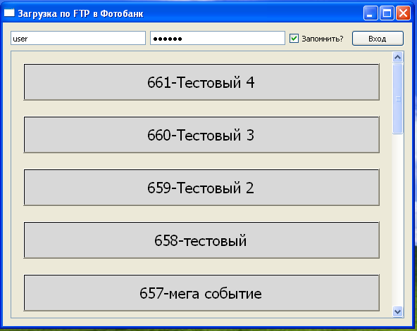
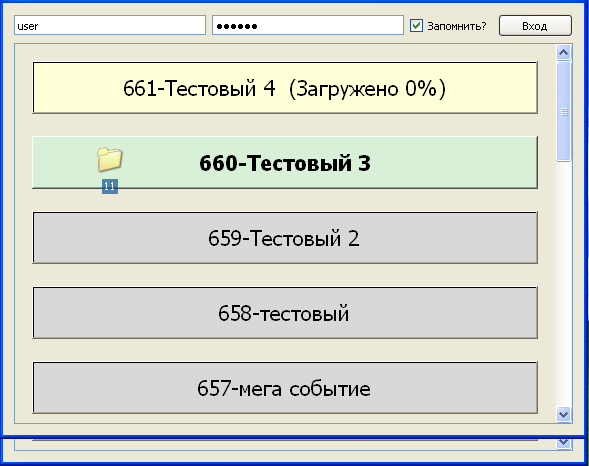

# Simple desktop FTP upload application

### How to use
* Launch
* Enter login and password to access you FTP account
* App will show you folders in you account as buttons
* Drag and drop files to the appropriate button. You may drag anything you want: files one-by-one, in a group, folders with subfolders. All will be placed in the "button" as flat folder without subsctructure

The only exception - files cannot have similar names.

### How to install
* The whole application is packed into 1 file - PyFTP.exe. Does not require installation and could be run on different computers.
* Sometimes depending on system settins you cannot run application as single file. In this case you can download it as packed or unpacked folder and run from it.

---

#Удобное десктопное приложение для загрузки фотографий в фотобанк

### Как использовать
* запустить приложение
* ввести свой логин и пароль для доступа в фотобанк
* на экране будут показаны последние альбомы в вашем аккаунте
 

* чтобы загрузить (или догрузить) файлы в нужный альбом, просто перетащите их на нужную кнопку. Перетаскивать можно как вам удобнее: поштучно, группой, папкой с подпапками и т.п. - программа сама загрузит как нужно.
 

Единственное ограничение - в папках не должно быть одинаковых имен файлов.

### Как установить
* Вся программа запакована в 1 файл - FotoWoman.exe. Не требует установки и настройки. Можно запускать на различных компьютерах с флешки.Скачайте себе на компьютер FotoWoman.exe. Запустите и убедитесь, что работает.
* Иногда в зависимости от настроек компьютера, первый вариант может не работать. В таком случае, скачайте папку FotoWoman к себе на компьютер. Для запуска программы, зайдите в нее и запустите файл pyftp1.exe с малиновым значком W.
